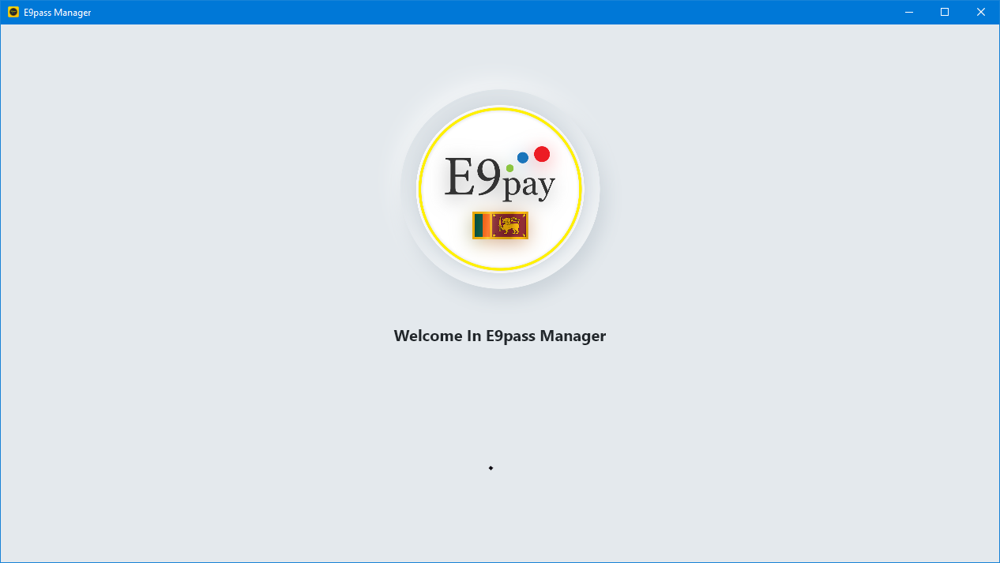
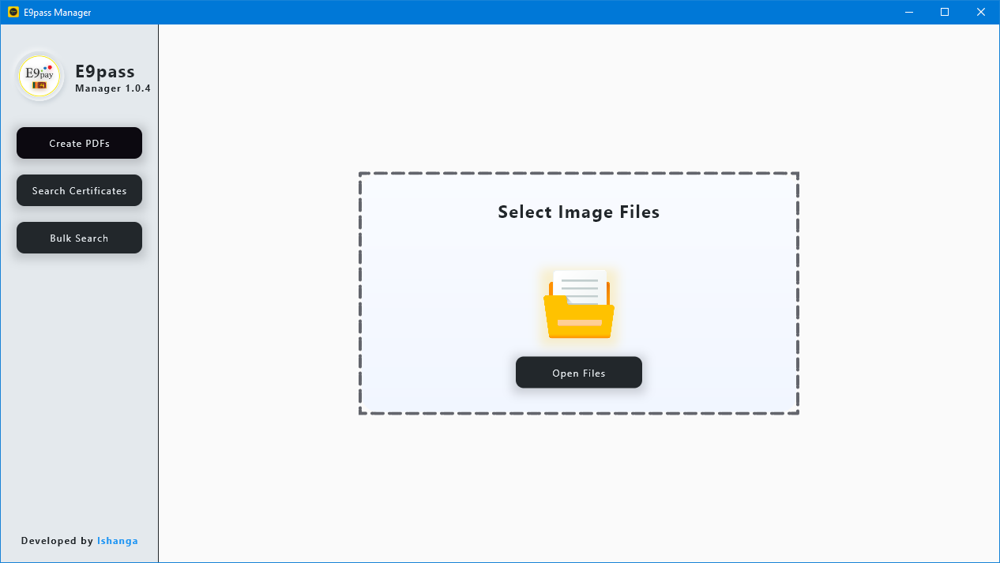
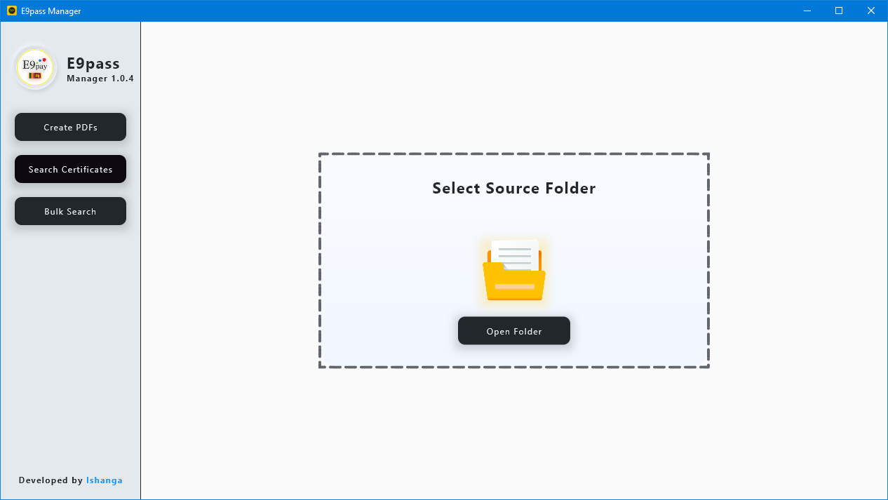

# E9pass Manager Native

   
  
  Check out the badges hosted by [shields.io](https://shields.io/).
  
  
  ## Description 
  
  *The what, why, and how:* 
  
  E9pass Manager Native Windows Application

  *This application is designed to do some specific work that required for the client company.*

  ## Screen Shot

  
  
  

  ## Table of Contents
  * [License](#license)
  
  ## License
  
  MIT License
  
  ---
  
  ## Questions?
  
   
  
  For any questions, please contact me with the information below:
 
  GitHub: [@ishangavidusha](https://api.github.com/users/ishangavidusha)
  